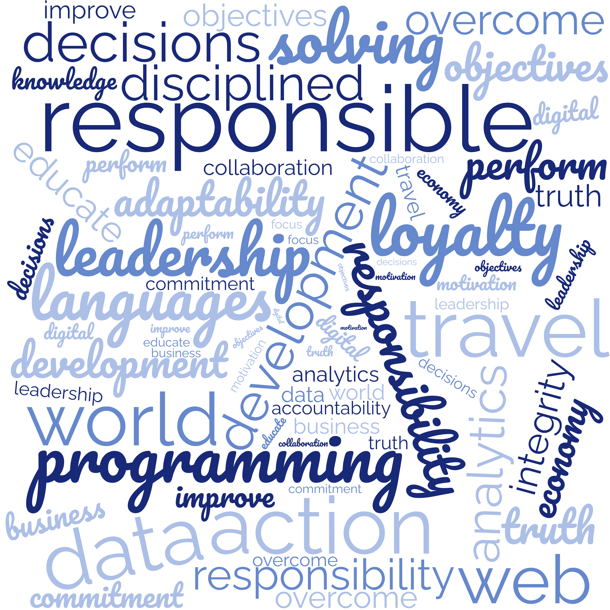

<h1 align="center">Hi there! Welcome back! 😀</h1>

<h2>About me</h2>

My name is Eligio, from <b>Guanajuato, Mexico</b> , and I am currently developing myself through <b>Web Developing</b> and <b>Data Analytics</b> programs! 

    <ul>
        <li>I'm currently working my way through Web Development within a bootcamp in TripleTen 💻⌨️🔭</li>
        <li>I'm currently learning Data Analytics through a Google certificate in Coursera 📊🌱💡</li>
        <li>I'm looking to collaborate on any kind of projects which could boost my FrontEnd and BackEnd profiles 🧐👯🤔</li>
        <li>You could reach me 📫 in any of the following platforms:</li>
    </ul>

    
    
    
     

<h2>Things I code with</h2>

    
    
    
    
    
    

 

<h2>Goals and values...</h2>

<h2>Statistics</h2>

    

    

    

